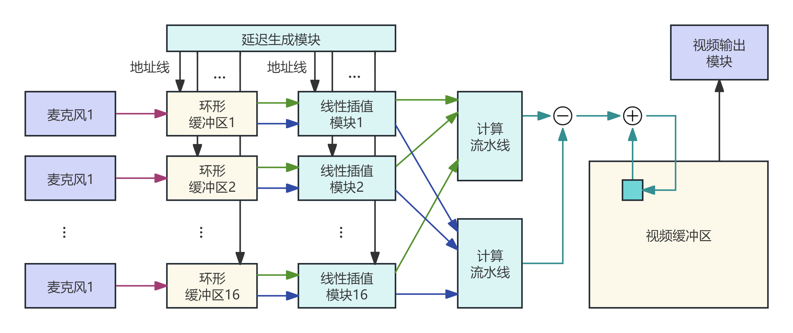
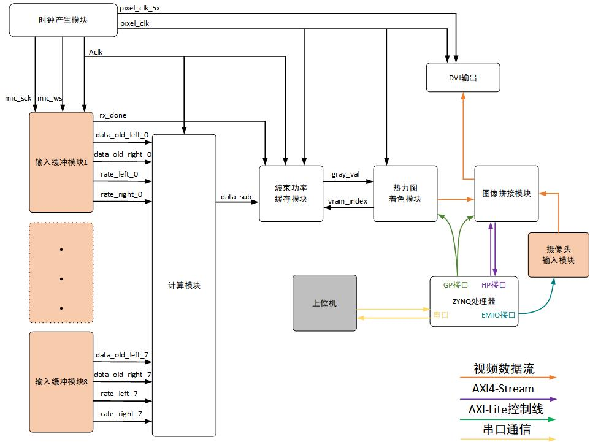
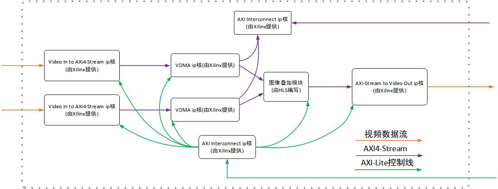

# 系统架构

## 目标与边界

`acoustic-camera-repro` 是以 `xc7z020clg400-2` 为目标器件的 Zynq 声学相机工程。PL 负责连续数据流和高并行计算；PS 负责外设初始化、AXI-Lite 配置、帧缓存控制及与上位机的参数交互。设计把声源方向/像素的能量映射为 128×72 声场网格，再与 OV5640 摄像头视频叠加输出。

```text
MEMS 麦克风阵列 ──> 采样/I2S ──> 环形缓冲 ──> 延迟+插值 ──> DAS 能量
                                             │                    │
                                             └──> 历史窗口 ───────┤
                                                                  v
OV5640 ──> 视频采集 ──> AXI4-Stream/VDMA ──> 视频叠加 <── 伪彩色/声场 BRAM
                                                                  │
PS: SCCB 初始化、AXI-Lite 参数、串口/上位机控制 ────────────────┘
                                                                  v
                                                             HDMI / DVI
```



*图：后续 16 通道架构的总体微架构，来源于 `高帧率低功耗的声学相机系统3月10日(1).docx`。*



*图：早期 8 通道系统的模块与控制接口，来源于 `基于Zynq的声学相机.pdf`。该图用于说明功能分区，不代表当前工程的通道数。*

## PL 功能分区

| 分区 | 主要职责 | 工程中的实现线索 |
| --- | --- | --- |
| 传感器与采样 | 接收串行麦克风数据、完成采样域到 PL 时钟域的数据交接 | `sensors.v`、`buffer_ctrl.v` |
| 时延访问 | 将像素方向对应的整数/分数时延转换为缓存地址和插值权重 | `vram_ctrl.v`、`delay_hls`、`vram_add_hls` |
| 波束形成 | 对多通道对齐采样求和并计算能量；新旧样本能量的差分更新滑窗 | `calculate`、`inter_hls`、`calculate` HLS IP |
| 声场缓存 | 保存每个声场像素的累计能量，支持计算侧更新和视频侧读取 | BRAM IP、`vram_ctrl.v` |
| 可视化 | 归一化/伪彩色、像素坐标映射、视频时序与热力图-相机叠加 | `color_mapping`、`pixel_mapping`、`add_image`、VDMA/video IP |
| 视频采集与输出 | OV5640 采集、AXI4-Stream 视频通路、DVI 发送 | `ov5640_capture_data`、`video_driver`、`DVI_TX` |

## PS 与控制面

PS 软件首先通过 SCCB 配置 OV5640，再初始化 VDMA 和各 AXI-Lite 外设。上位机可以通过串口协议调节热力图色阶阈值及相机/热力图的叠加透明度。控制面不进入高吞吐声学计算闭环，因此参数更新应以帧边界或设计定义的安全时点生效。



*图：早期实现的视频叠加数据流；橙色为视频、紫色为 AXI4-Stream、绿色为 AXI-Lite。*

## 时钟与存储

资料给出的 PL 主频为 210 MHz，麦克风采样率为 21.875 kHz。声学计算在一个采样周期内遍历全部 9,216 个声场网格点；视频路径使用独立的视频像素时钟和 VDMA/DDR 帧缓存跨接。时钟域、复位极性和实际板级引脚必须以最终 Block Design 与 XDC 为准。

## 开发时的关键约束

- `system.bd` 是集成入口；不要手工编辑 Vivado 生成的 `system_wrapper.v`。
- 自定义 IP 和 HLS IP 已被分别纳入 `ip_repo/` 与 `hls_ip_repo/`；修改算法接口前，应同时检查 Block Design 连接与 PS 驱动参数。
- XDC 由历史工程导入。烧录前必须针对实际开发板、摄像头和 HDMI/DVI 接口复核引脚与电气标准。
