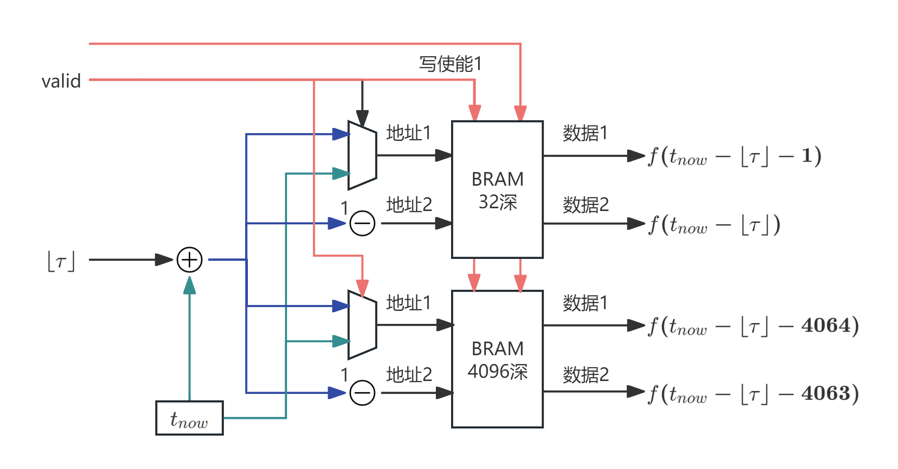
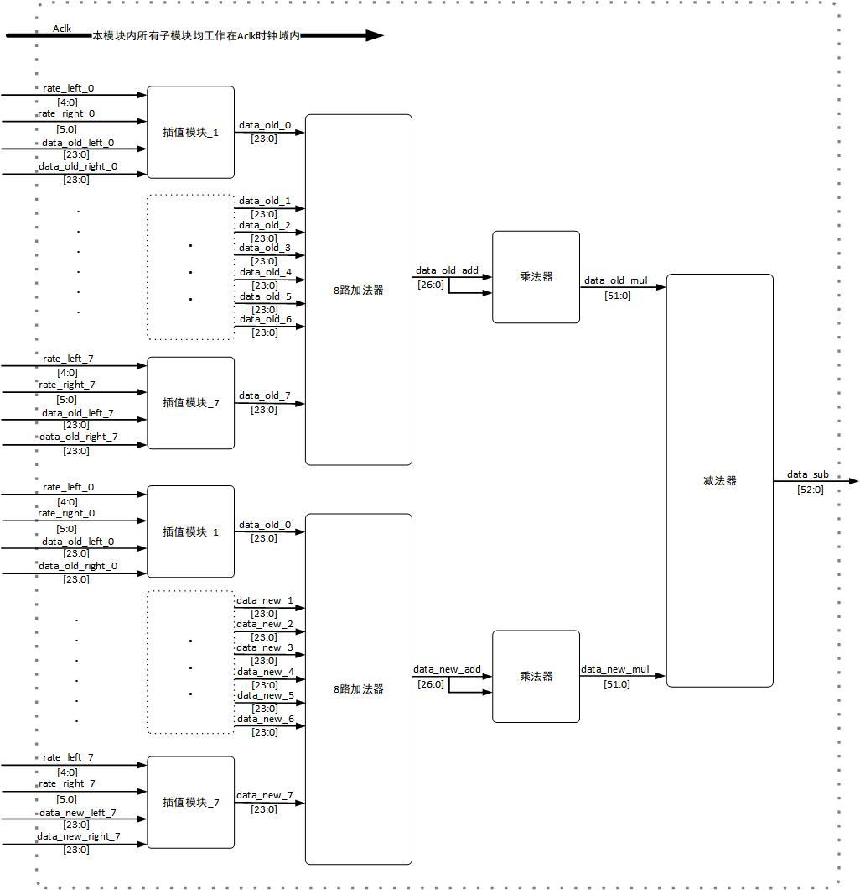
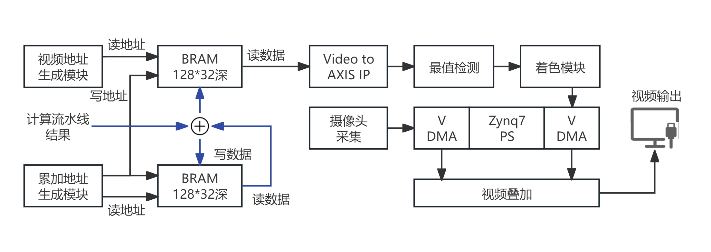

# 波束形成与数据通路

## 成像模型

对每一个声场网格点，系统根据阵元几何和该点对应的空间指向，计算每个麦克风的传播时延。对齐后的通道采样相加，再对和信号求能量，构成常规延迟求和（Delay-and-Sum, DAS）波束形成：

```text
beam(t, p) = sum over microphone m of x_m(t - tau_m(p))
energy(t, p) = beam(t, p)^2
```

这里 `p` 是 128×72 网格中的一个像素，`tau_m(p)` 是第 `m` 通道的延迟。远场近似下，网格坐标经小孔模型转换为单位方向向量，再与阵元位置点乘得到相对传播距离。

## 分数延迟

延迟被分成整数部分 `N` 和 1/32 采样周期精度的分数部分 `f`。整数部分选择环形缓冲中的相邻样本，分数部分用于线性插值：

```text
x(t - tau) ~= ((32 - f) * x[N] + f * x[N + 1]) >> 5
```

输入样本为 24 位有符号数据；插值乘积和中间加法位宽应由 HLS/RTL 保留，避免截断破坏微弱声源的相位一致性。资料提出该结构是降低采样时间离散化误差的核心手段。

## 环形缓存与历史窗口

每个通道保存近期数据，使计算流水线可以在任一声场点读取：

- 当前时刻的两个相邻样本，用于当前能量；
- 约 4,064 个采样周期前的两个相邻样本，用于历史能量。

由于 BRAM 端口数量有限，历史方案将短期和长期访问拆分为浅缓存与 4,096 深缓存。实现或优化该部分时，必须同时核对读端口冲突、地址回绕和计算流水线延迟对齐。



*图：后续 16 通道设计中单通道环形缓存的读写与历史样本寻址。*

## 滑窗式能量更新

不为每个网格点在每个采样时刻重新累加整个窗口，而是采用增量更新：

```text
power_window[p] <- power_window[p]
                   + energy(current, p)
                   - energy(history, p)
```

两条全吞吐计算流水线分别给出当前与历史样本的能量。这样每个采样周期只处理新进入与离开窗口的样本，且能以一网格点/时钟的节奏扫描全部 9,216 个点。这是本工程高帧率设计的主要数据复用策略。



*图：早期实现的计算流水线；当前工程的后续资料将这一思路扩展为 16 通道双流水线。*

## 可视化通路

声场 BRAM 的累计功率在视频侧被读取，经最值/归一化与颜色映射成为 RGB 图。像素映射把 720p 坐标关联到 128×72 网格；随后图像叠加 IP 使用可配置透明度将热力图合成到摄像头画面。色阶阈值由 PS 通过 AXI-Lite 配置，宜在帧边界更新以避免同一帧发生色彩跳变。



*图：后续设计的声场缓存与视频输出模块。*

## 算法替换注意事项

资料指出计算流水线可演进至 DMAS 或相干因子加权 DAS。替换前应明确评估：延迟接口和采样格式是否不变、乘法/DSP 使用量、累加位宽、流水线深度，以及滑窗中的“新增/移除”能量定义是否仍成立。
