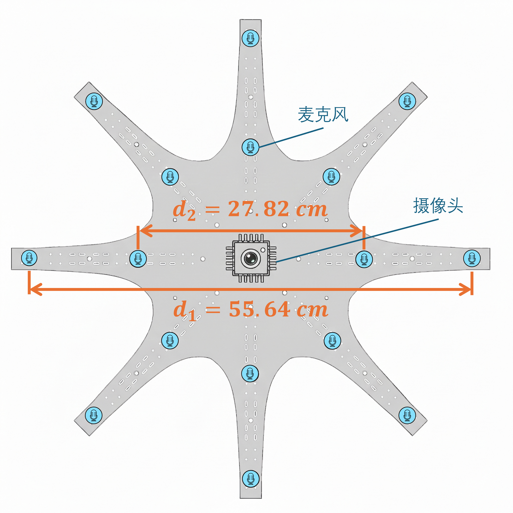

# 设计依据与性能口径

## 资料与版本关系

本仓库来源于一个包含多个历史工程、HLS 导出物和软件工程的资料集。两份设计材料记录的不是完全相同的硬件版本：

| 资料 | 描述的配置 | 在本文档中的用途 |
| --- | --- | --- |
| 《基于 Zynq 的声学相机》PDF | 8 麦克风、128×72 热力图、60 FPS 级可视化的早期实现 | 模块职责、PS/PL 分工、视频叠加与上位机控制 |
| 《高帧率低功耗的声学相机系统》DOCX | 16 通道、分数延迟、滑窗累加、Zynq-7020 后续实现 | 当前算法架构、采样/缓存策略和论文评测口径 |

因此，`8` 与 `16` 通道、`60 FPS` 与“每秒约两万次定位/网格更新”等数值不可直接并列比较。当前可重建的 Block Design 应被视作代码真源；文档中的数值只在其原始版本上下文内成立。

## 后续架构的设计参数

后续设计材料给出以下目标或实现参数：

| 项目 | 数值/描述 |
| --- | --- |
| 器件 | Zynq-7020 / `xc7z020clg400-2` |
| 通道数 | 16 路同步采样 |
| 样本格式 | 24 位 MEMS 麦克风数据 |
| 采样率 | 21.875 kHz（理论上限约 22.786 kHz） |
| 声场网格 | 128×72，即 9,216 点 |
| 分数延迟精度 | 1/32 个采样周期，线性插值 |
| 历史滑窗 | 约 4,064 个采样周期 |
| PL 主频 | 210 MHz |

文中使用“位宽锁定、带宽优先”的取舍：24 位量化满足动态范围需求后，优先保持采样率以减小时间离散化误差。时间误差会导致阵列增益按 `sinc(f/Fs)` 型关系衰减；分数延迟用于进一步改善这一误差。

*图：后续资料描述的双圆环 16 麦克风阵列。标注尺寸属于该资料的实验装置，应在实际硬件复刻时重新核对。*

## 资源与评测结果（历史报告值）

后续材料报告的 Zynq-7020 实现资源为 LUT 17,543（32.81%）、FF 29,080（27.33%）、BRAM 119（85%）和 DSP 97（44.09%）。BRAM 是最紧张资源，应在修改缓存深度、视频缓存或时延表宽度前先评估。

同一材料给出的单帧声场计算平均时间为 0.0439 ms、平均功率为 3.53 W，并据此报告 6.45×10^6 graph/kJ 的能效。该结果与 R5 5600H、STM32H750RCT6 的软件基线相比，使用的是文中定义的数据规模和算法版本；它不是当前重建工程重新综合或实机测试得到的保证值。

## 可验证性与下一步

Vivado 综合只验证结构、时序约束和资源可实现性，不验证声源定位精度、功耗或帧率。要复核资料中的性能结论，需要：

1. 使用目标板和最终 XDC 完成实现与时序收敛；
2. 以已知单声源/多声源布置验证空间配准与分辨能力；
3. 记录实际采样率、声场刷新节奏和 HDMI 输出帧率；
4. 用受控电源测量整机功耗，并明确比较基线的算法、分辨率和窗口长度。

## 参考资料

- `../高帧率低功耗的声学相机系统3月10日(1).docx`
- `../基于Zynq的声学相机.pdf`

以上文件保留在父目录的原始资料集，未复制进此 Git 工程以避免混入大体积、不可版本化的参考附件。
